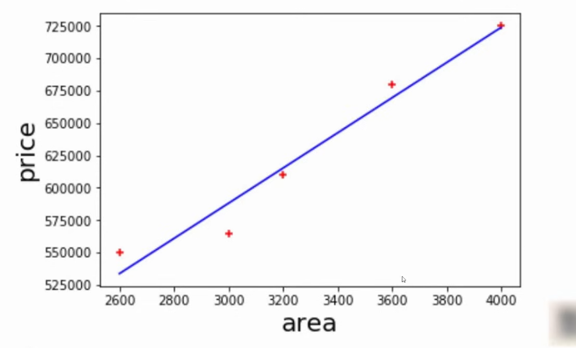
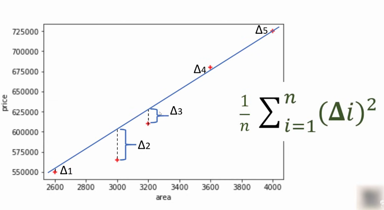
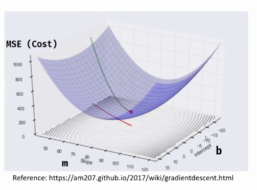
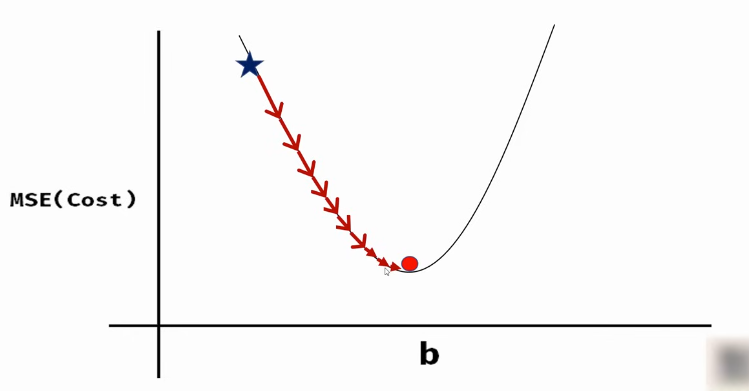
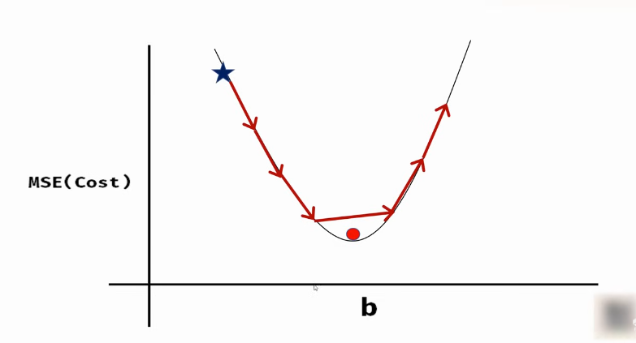
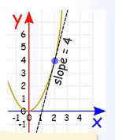

# Mean Square Error, Cost Function, Gradient Descent, and Learning Rate

These are some of the **core concepts** in machine learning. By the end of this explanation, we’ll understand these concepts and how to **implement gradient descent in Python**.

---

## 1. Introduction

When you begin studying machine learning, you often encounter **mathematical equations** that can feel intimidating.
But don’t worry — understanding them step-by-step makes things clear.

In real ML projects, you won’t code gradient descent manually (libraries like **scikit-learn** handle it).
However, knowing **how it works internally** helps you use these libraries more effectively.

---

## 2. Prediction Function

In traditional algebra, you had an equation like:

$$
y = 3x + 3
$$

If (x = 2), you get (y = 9).
In machine learning, however, we have **training data** — input (x) and output (y).
We use this data to **derive the equation** (the *prediction function*) that can predict future values.

For example, in predicting home prices, you might have:

* Input: *Area*
* Output: *Price*

Using this, we derive a line:

$$
y = mx + b
$$

Where:

* (m) = slope (coefficient)
* (b) = intercept

---

## 3. Mean Squared Error (MSE) – The Cost Function

When plotting data, you can draw many possible lines — but **which line fits best?**
To find out, we calculate how far off each prediction is from actual data.

For each data point:
$$
\text{Error} = y_{\text{actual}} - y_{\text{predicted}}
$$

Then we square each error (to handle negatives) and take the mean:

$$
\text{Mean Squared Error (MSE)} = \frac{1}{n} \sum (y_{\text{actual}} - y_{\text{predicted}})^2
$$



This MSE is our **Cost Function** — a measure of how bad our predictions are.
Smaller cost = better fit.

Substituting ($y_{\text{predicted}}$ = mx + b):

$$
J(m, b) = \frac{1}{n} \sum (y_i - (mx_i + b))^2
$$

---

## 4. Gradient Descent – Finding the Best Fit Line

Trying every possible (m) and (b) combination is inefficient.
**Gradient Descent** provides an efficient way to reach the *best fit line* (minimum cost).

Imagine plotting MSE against different (m) and (b).
The plot looks like a **bowl-shaped surface** — the goal is to reach the **lowest point (minimum cost)**.

### The Process:

1. Start with random (m) and (b) (usually 0).
2. Compute the cost.
3. Move slightly in the direction where the cost decreases.
4. Repeat until the cost stops decreasing (we reach the minima).



---

## 5. The Learning Rate

The **learning rate (α)** controls the size of each step taken toward the minima.

* If α is **too small**, convergence is slow.

* If α is **too large**, we may overshoot the minima and never converge.


At each step, we update:

$$
m_{\text{new}} = m_{\text{current}} - \alpha \frac{\partial J}{\partial m}
$$
$$
b_{\text{new}} = b_{\text{current}} - \alpha \frac{\partial J}{\partial b}
$$


---

## 6. Understanding Derivatives

A **derivative** represents the **slope** of a curve — or the **rate of change**.

$$
\text{Slope} = \frac{\Delta y}{\Delta x}
$$

In calculus, this becomes:
$$
\frac{dy}{dx}
$$

For example, the derivative of (x^2) is (2x).
That means the slope of (x^2) at any point (x) is (2x).



---

## 7. Partial Derivatives

When the cost function depends on **two variables (m and b)**, we use **partial derivatives**.

$$
\frac{\partial J}{\partial m} = \text{change in cost w.r.t. m (keep b constant)}
$$
$$
\frac{\partial J}{\partial b} = \text{change in cost w.r.t. b (keep m constant)}
$$

These derivatives tell us **which direction** to move (m) and (b) to reduce cost.

---

## 8. Derivatives of the MSE Function

Given:
$$
J(m,b) = \frac{1}{n} \sum (y - (mx + b))^2
$$

The partial derivatives are:

$$
\frac{\partial J}{\partial m} = -\frac{2}{n} \sum x(y - (mx + b))
$$
$$
\frac{\partial J}{\partial b} = -\frac{2}{n} \sum (y - (mx + b))
$$

These represent the **slope directions** for (m) and (b).
*The values of derivatives of m and b are to be remembered as they are for this lecture's scope. Follow other sources for more information on these.*

---

## 9. Gradient Descent Update Rules

We iteratively update parameters using:

$$
m = m - \alpha \frac{\partial J}{\partial m}
$$
$$
b = b - \alpha \frac{\partial J}{\partial b}
$$

Repeat until cost (J) stops decreasing significantly.

---

## 10. Python Implementation

```python
import numpy as np

# Data
x = np.array([1, 2, 3, 4, 5])
y = np.array([3, 5, 7, 9, 11])

# Parameters
m, b = 0, 0
L = 0.01   # Learning rate
epochs = 1000

n = len(x)

for i in range(epochs):
    y_pred = m * x + b
    D_m = (-2/n) * sum(x * (y - y_pred))
    D_b = (-2/n) * sum(y - y_pred)
    m -= L * D_m
    b -= L * D_b

    cost = (1/n) * sum((y - y_pred)**2)
    print(f"Iteration {i}, Cost {cost}, m {m}, b {b}")
```

We adjust the learning rate and number of steps until the cost gets to 0 or negligible.

---

## 11. Tuning the Learning Rate

Try different learning rates:

* If cost **decreases steadily**, α is good.
* If cost **increases or oscillates**, α is too high.

Stop when cost changes between iterations are minimal.

Example threshold check:

```python
import math
if math.isclose(cost_prev, cost, rel_tol=1e-20):
    break
```